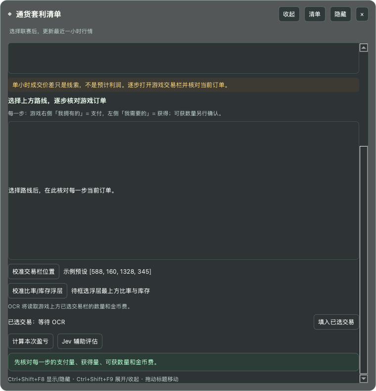
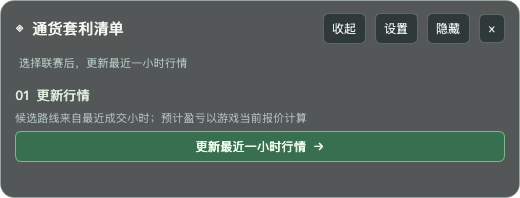
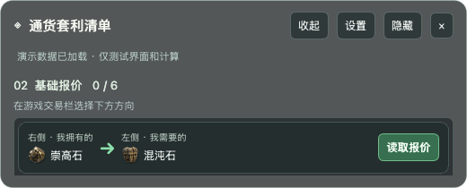
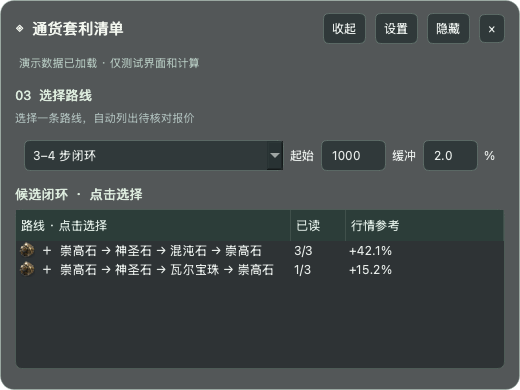
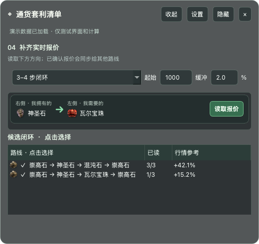
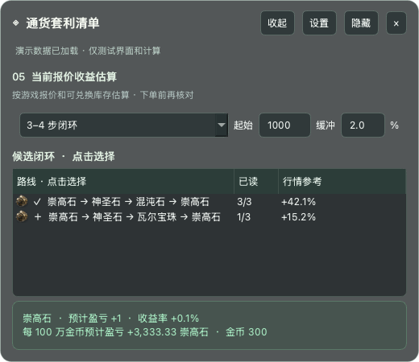

# PoE2 Currency Arbitrage Overlay

A Windows desktop overlay for researching currency exchange routes in Path of Exile 2. It stays on top of the game as a small, translucent checklist. The app does not need a browser or a local web server while running.

The interface is currently in Chinese. `Ctrl+Shift+F8` shows or hides it; `Ctrl+Shift+F9` expands or collapses it. Borderless windowed game mode is recommended.

## Use it in game

The screenshots below use **demo market data and example quotes** to show the interface. Their routes and estimated gains are not live opportunities. The overlay shows only the current step; finishing it reveals the next one.

### Before the first read: calibrate OCR

1. [Run the app](#run-on-windows) or launch the built EXE, then open PoE2 in borderless windowed mode and open the Currency Exchange. Keep the exchange panel in the same position while using the overlay.
2. Click **设置** (Settings), scroll down, and click **校准交易栏位置** (Calibrate trade area). Drag a rectangle around the *selected exchange at the top of the game panel*, including both currency names, the two integer amounts, and the gold fee. Press `Esc` to cancel a selection.
3. For automatic available-stock reading, also click **校准比率/库存浮层** (Calibrate rate/stock hover). While the delayed screenshot is taken, hover the game's rate to expose the best-rate row and draw a rectangle around its ratio and stock. You can leave this uncalibrated and enter the available stock manually after each read.
4. Click **清单** (Checklist) to return to the small in-game view.



The bundled trade-area preset is `[588, 160, 1328, 345]` for the supplied 1920×1080 reference layout without the inventory panel. Recalibrate if resolution, UI scale, or exchange-panel position differs. The stock hover region has no preset.

### 01 — Update the market hour

Click **更新最近一小时行情** (Update latest hourly market data). The app loads the latest published GGG trade hour. You can adjust league and route filters under **设置**. **更新 Scout 快照** (Update Scout snapshot) there is optional for the single-item mode.



### 02 — Read the six core directions

The checklist now shows one exchange direction at a time among Exalted, Chaos, and Divine Orbs. In the game, put the currency under **右侧 · 我拥有的** (right side, I Have) and the target under **左侧 · 我需要的** (left side, I Want). Click **读取报价** (Read quote). The overlay briefly hides, captures the calibrated area, then returns.



Check the recognized **pay amount, receive amount, available stock, and gold fee**. If OCR cannot confirm stock or gold, enter the missing integer in the overlay and click **确认报价** (Confirm quote). A successfully confirmed pair is checked off and the next direction appears. If the currency names or amounts are wrong, correct the game selection or calibration and read again. After all six directions, route selection appears automatically.

### 03 — Pick a route or single-round mode

Choose a mode from the dropdown:

| Mode in the overlay | What you select |
| --- | --- |
| **3–4 步闭环** (3–4 step cycle) | A candidate loop from the newest trade hour. Set **起始** (starting quantity) before comparing candidates. |
| **基础双向套利** (core round trip) | A pair of core currencies; the app uses independently read quotes in both directions. |
| **单品跨币种套利** (cross-currency item flip) | An item route that buys with one core currency, sells for another, then converts back. |

In a route list, **已读** tells you how many exchange directions have current game quotes. **行情参考** shows what the last published trade hour suggests for your starting amount; you cannot place an order at that number. Click a row to see which current game quotes are still needed. The **缓冲** (buffer) field is the minimum return you want to see in single-round modes, not a guaranteed return.



### 04 — Read any missing live quotes

For the selected route, the checklist displays only the next missing direction. Select that direction in the game and click **读取报价** again. Repeat until the route is complete. Confirmed quotes for the same directed pair are reused across routes; the reverse direction is a separate quote.



### 05 — Check the estimated outcome, then trade manually

The result shows **预计盈亏** (estimated gain or loss in your starting currency), **收益率** (return on the amount you started with), the estimated gain or loss **per 1 million gold**, and the gold cost. The app uses the exchange quantities and available stock read from the game; it counts only complete exchanges, since you cannot trade a fraction of a currency item. A positive result is still only a check of the captured orders: prices and stock can change before an order fills. Re-read old or changed quotes and verify the gold fee at the quantity you intend to trade. The app never places trades.



Use `Ctrl+Shift+F8` to hide/show the overlay, `Ctrl+Shift+F9` to collapse/expand it, or drag its title bar to move it. If no route appears, refresh the market hour or adjust the starting quantity and filters in **设置**. If OCR repeatedly misses the order, recalibrate the trade area; stock can be entered manually when its hover region is not calibrated.

## Route modes and data sources

**Hourly cycles:** Scan three- and four-step loops across all currencies connected by trades in the newest published GGG hour for the selected league. Each pair's traded amounts yield an hourly volume-weighted average price (VWAP), divided by 1.02 for an assumed fill spread per leg. The reported execution-price range is used as a quality check: identical endpoints or a range wider than 50% are discarded. Apparent cycle gaps over 50% are also excluded. The overlay shows the exact source hour. The user-entered starting quantity is floored to whole units at every leg; candidates that fail to return more whole units or exceed an hourly traded amount are omitted, and the surviving routes rank by whole-unit reference profit. This screening cannot substitute for live stock, an executable lot size, or gold fees. It follows the hourly VWAP approach described by [lilmarket](https://poe2.lilmarket.io/arbitrage/), but does not reproduce all of its liquidity, consensus, minimum-profitable-lot, or gold-cost filters.

**Core round trips:** Check both independently observed directions of an Exalted/Chaos/Divine pair. One direction is never inferred by inverting the other.

**Cross-currency item flips:** Scan `A → item X → B → A`, where A and B are different core currencies. The preferred candidate source is Poe2Scout's `SnapshotPairs`: each pair has an independently measured `RelativePrice` ratio. If there is no snapshot for the selected league from the last two hours, the app falls back to the newest GGG trade hour. Every proposed trade is still verified with three in-game quotes.

The Poe2Scout filter requires at least 10,000 reported volume in each book and at least 1,000 `StockValue` on the receiving side, and omits indicative gaps over 50%. These are noise-reduction heuristics and can miss real opportunities. The app displays the actual `ExchangeSnapshot.Epoch` age. `SnapshotPairs` is a snapshot, **not a second-by-second executable order book**.

Both single-round modes require the oldest in-game quote to be no more than 45 seconds old, with no more than 25 seconds between observations. A configurable 2% starting-capital buffer helps account for movement. Multi-lot gold cost is estimated by scaling the displayed order fee and must be checked again in game at the intended size. If a trade fills only partly, recalculate subsequent trades from the amount actually received.

The bundled offline catalog covers 679 exchange items, including local names and icons where available. New IDs receive a readable fallback label and placeholder icon. The catalog and icons are reference assets; this is an unofficial fan tool and is not affiliated with Grinding Gear Games.

## Run on Windows

Requires Windows 10/11 and Python 3.12:

```powershell
py -3.12 -m venv .venv
.venv\Scripts\activate
pip install -r requirements.txt
python main.py
```

The app uses local RapidOCR and ONNX Runtime models. Market data needs network access; OCR and integer simulation run locally. App data is stored under `%LOCALAPPDATA%\PoE2ArbDesk\` and can be redirected with `POE2ARB_DATA_DIR`.

Optional Jev assessment sends the selected route and manually confirmed numbers to the TypeSafe API only when you press its button and configure `TYPESAFE_API_KEY`. Its opinion never replaces the local arithmetic.

## Build the EXE

Run `build-windows.bat` on Windows or use the repository's **Build Windows EXE** GitHub Actions workflow. Distribute the entire `dist\PoE2ArbDesk\` directory and launch `PoE2ArbDesk.exe`. The build uses PyInstaller `--windowed --onedir`. A macOS build cannot produce or validate the Windows EXE.

## Verification and limits

Run `python -m unittest discover -s tests -v` and `python main.py --self-test`. Development verification is recorded in [VERIFY.md](VERIFY.md). Windows game testing is still needed for the stock OCR region, hotkeys, and borderless-window overlay behavior.

The tool reads public market data and user-triggered screenshots. It does not read game memory, drive the mouse or keyboard, switch pairs, fill orders, or place trades. Prices and stock can change after a screenshot; displayed profit is never guaranteed.
