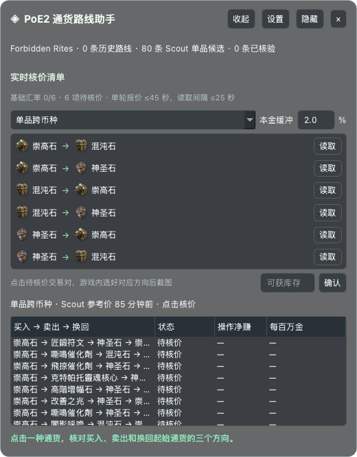

# PoE2 Currency Arbitrage Overlay

A Windows desktop overlay for researching currency exchange routes in Path of Exile 2. It stays on top of the game as a small, translucent checklist. The app does not need a browser or a local web server while running.



The interface is currently in Chinese. `Ctrl+Shift+F8` shows or hides it; `Ctrl+Shift+F9` expands or collapses it. Borderless windowed game mode is recommended.

## How it works

1. Load GGG's hourly exchange history and/or a Poe2Scout snapshot in **Settings**. The initial checklist asks for the six directed exchanges among Exalted, Chaos, and Divine Orbs.
2. Select each requested pair manually in the game's Currency Exchange. Click **Read** to capture the selected trade panel. OCR reads the two currencies, order quantities, and gold fee. A separately calibrated OCR region reads the available quantity. If any field is uncertain, enter or confirm it manually.
3. Completed pairs disappear from the checklist and their quotes are reused by every candidate route that needs the same direction.
4. Choose a route. The checklist requests any missing quotes, then simulates whole order lots using the current quantities and available stock. The result shows net profit per operation, profit per 1 million gold, required gold, and return on the starting currency.

The default trade capture area is `[588, 160, 1328, 345]` on the user's 1920×1080 reference screenshot without the inventory panel. It covers the selected exchange at the top of the exchange window. Recalibrate it if your resolution, UI scale, or window position differs. The available stock region must be calibrated separately in the game.

## Route modes and data sources

**Hourly cycles:** Scan three- and four-step loops across all currencies connected by trades in the newest published GGG hour for the selected league. Each pair's traded amounts yield an hourly volume-weighted average price (VWAP), divided by 1.02 for an assumed fill spread per leg. The reported execution-price range is used as a quality check: identical endpoints or a range wider than 50% are discarded. Apparent cycle gaps over 50% are also excluded. The overlay shows the exact source hour. The user-entered starting quantity is floored to whole units at every leg; candidates that fail to return more whole units or exceed an hourly traded amount are omitted, and the surviving routes rank by whole-unit reference profit. This screening cannot substitute for live stock, an executable lot size, or gold fees. It follows the hourly VWAP approach described by [lilmarket](https://poe2.lilmarket.io/arbitrage/), but does not reproduce all of its liquidity, consensus, minimum-profitable-lot, or gold-cost filters.

**Core round trips:** Check both independently observed directions of an Exalted/Chaos/Divine pair. One direction is never inferred by inverting the other.

**Cross-currency item flips:** Scan `A → item X → B → A`, where A and B are different core currencies. The preferred candidate source is Poe2Scout's `SnapshotPairs`: each pair has an independently measured `RelativePrice` ratio. If there is no snapshot for the selected league from the last two hours, the app falls back to the newest GGG trade hour. Every proposed trade is still verified with three in-game quotes.

The Poe2Scout filter requires at least 10,000 reported volume in each book and at least 1,000 `StockValue` on the receiving side, and omits indicative gaps over 50%. These are noise-reduction heuristics and can miss real opportunities. The app displays the actual `ExchangeSnapshot.Epoch` age. `SnapshotPairs` is a snapshot, **not a second-by-second executable order book**.

Both single-round modes require the oldest in-game quote to be no more than 45 seconds old, with no more than 25 seconds between observations. A configurable 2% starting-capital buffer helps account for movement. Multi-lot gold cost is estimated by scaling the displayed order fee and must be checked again in game at the intended size. If a trade fills only partly, recalculate subsequent trades from the amount actually received.

The bundled offline catalog covers 679 exchange items, including local names and icons where available. New IDs receive a readable fallback label and placeholder icon. The catalog and icons are reference assets; this is an unofficial fan tool and is not affiliated with Grinding Gear Games.

## Run on Windows

Requires Windows 10/11 and Python 3.12:

```powershell
py -3.12 -m venv .venv
.venv\Scripts\activate
pip install -r requirements.txt
python main.py
```

The app uses local RapidOCR and ONNX Runtime models. Market data needs network access; OCR and integer simulation run locally. App data is stored under `%LOCALAPPDATA%\PoE2ArbDesk\` and can be redirected with `POE2ARB_DATA_DIR`.

Optional Jev assessment sends the selected route and manually confirmed numbers to the TypeSafe API only when you press its button and configure `TYPESAFE_API_KEY`. Its opinion never replaces the local arithmetic.

## Build the EXE

Run `build-windows.bat` on Windows or use the repository's **Build Windows EXE** GitHub Actions workflow. Distribute the entire `dist\PoE2ArbDesk\` directory and launch `PoE2ArbDesk.exe`. The build uses PyInstaller `--windowed --onedir`. A macOS build cannot produce or validate the Windows EXE.

## Verification and limits

Run `python -m unittest discover -s tests -v` and `python main.py --self-test`. Development verification is recorded in [VERIFY.md](VERIFY.md). Windows game testing is still needed for the stock OCR region, hotkeys, and borderless-window overlay behavior.

The tool reads public market data and user-triggered screenshots. It does not read game memory, drive the mouse or keyboard, switch pairs, fill orders, or place trades. Prices and stock can change after a screenshot; displayed profit is never guaranteed.
