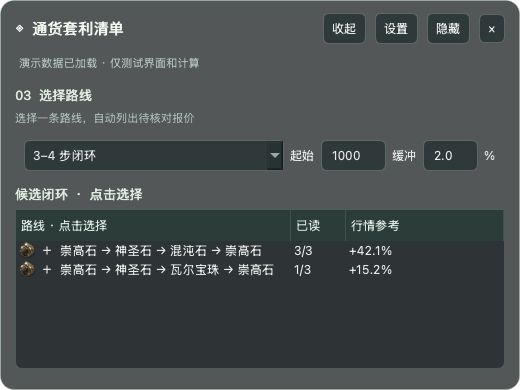
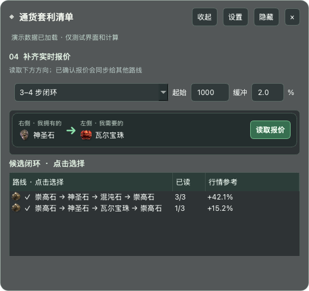
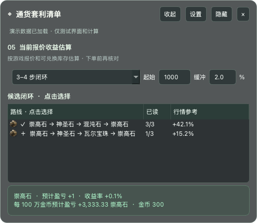
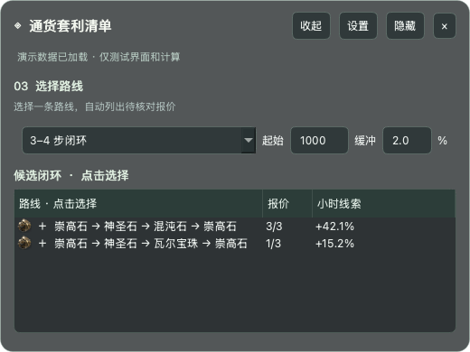
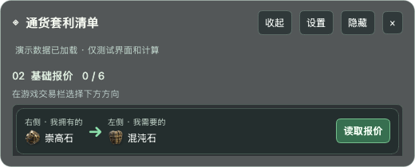

<div align="center">
  
  <h1>PoE2 Single-Item Arbitrage Assistant</h1>
  <p>A Windows desktop companion for checking three-leg currency exchange opportunities in Path of Exile 2.</p>
  <p><strong>English</strong> · <a href="README.zh-CN.md">简体中文</a></p>
</div>

> [!IMPORTANT]
> This is an unofficial player tool and is not affiliated with Grinding Gear Games. It never controls the game or places orders. Always verify prices, direction, stock, and gold fees in game before trading.

The app checks the spread of a single item across Exalted Orbs, Divine Orbs, and Chaos Orbs. Six directed core exchange rates appear at the top; the item and the currencies used to buy and sell it are selected in the middle; order sizes from the game are entered below. The result includes profit after returning to the starting currency, minimum integer trade sizes, stock limits, and profit per million gold. Item and currency icons are loaded from the local catalog.

## Screenshots

| Pick a historical lead | Read the live order | Review the estimate |
| --- | --- | --- |
|  |  |  |

The compact overlay keeps the route, quote progress, and result visible while you check the in-game Currency Exchange:



> The current application UI is Chinese. This README translates the workflow and constraints; it does not imply that the desktop UI has been localized.

## Workflow

1. **Start the app and select a league.** The app updates GGG hourly history and a Poe2Scout snapshot in the background. Historical data only suggests which item to inspect first; it is never treated as an executable price.

2. **Choose a candidate route.** Use **Select item from historical leads** to browse items ranked by historical signals, or search by a Chinese or English name. Historical leads below the selector are also clickable. Each lead identifies the buy and sell currencies. Selecting a positive lead fills in that route automatically, but it can still be changed manually. Previously selected items stay under **Recent selections** for quick access.

   A lead is excluded if either side of a pair has less than 100 units of volume. A Scout snapshot also requires at least 100,000 aggregate volume for the pair. If any pair in the three-leg path misses its threshold, the whole lead is hidden. This reduces thin-market noise but does not prove that the remaining price is executable.

   Scout data is used only when its timestamp is no more than 15 minutes old. After launch, the app checks every five minutes; **Refresh historical leads** refreshes both Scout and hourly history. Re-downloading an old Scout snapshot does not make its quote fresh. The app falls back to hourly history that is no more than two hours old, and pauses recommendations when both sources are stale. Every lead shows its actual source and timestamp.

3. **Check all three legs in game.** In Currency Exchange, inspect:

   ```text
   Starting currency -> Item
   Item -> Selling currency
   Selling currency -> Starting currency
   ```

   On the game screen, the right side (**I Have**) is what you pay and the left side (**I Want**) is what you receive.

4. **Enter or capture the live orders.** For each leg, fill in the amount paid, amount received, and available stock. The app saves and recalculates after input stops. For the item purchase, also enter the gold required for one traded item; total gold is derived from the number of items received.

   Paid and received amounts may be decimal. On save, a fractional ratio is reduced to the smallest integer order—for example, `1.5 -> 1` becomes `3 -> 2`. When both values are already integers, the original order size is retained. A quote can still be saved as a reference if stock does not cover one order, but it is marked **Insufficient stock**. A screenshot's total item gold is converted to per-item gold only when it divides evenly by the item quantity.

   Core-rate cards show both directed quotes and their ages. Use **Update** on the relevant card to enter an order or read it from a screenshot. If OCR regions drift, use the two calibration controls at the bottom of the window.

   

5. **Review the calculation.** The right side reports progress across the three quotes. Once all legs are present, the app shows the starting cost and profit for the smallest complete cycle, return percentage, maximum cycles allowed by stock, and—when exact per-order gold is known—profit per million gold.

   To inspect rate-only opportunities, enable **Ignore stock · theoretical spread only**. Stock may then remain empty. The app uses only the top quote for each leg, performs integer-order arithmetic, does not match multiple depth levels, and does not claim that the route is executable.

6. **Record completed trades.** In **Actual trade log**, choose Buy, Sell, or Return; enter only what was actually paid and received; then select **Record actual fill**. Item gold comes from the per-item price in the buy quote. Base-currency gold is calculated from fixed rates. If the item gold is unknown, the fill can be recorded first and completed later by entering the unit price.

   **Use current quote** only pre-fills the form; compare it with the in-game fill before saving. After the return leg is complete and all other currency balances are zero, the app shows realized net profit in the starting currency. Open positions are valued using the current directed quotes and display quote age. Records can be deleted and are persisted with app settings, grouped by league, item, and route.

The trade log spells out the full path—**starting currency -> traded item -> selling currency -> starting currency**—and the exact assets paid and received for the selected leg. In narrow windows, the order and result panels stack vertically instead of forcing horizontal scrolling.

## Multi-level depth and OCR

When a screenshot contains the full market ladder, OCR temporarily stores multiple ratios and stock levels. Verify direction and amounts, then select **Save reading** for that row before the data is used.

The **Multi-level stock** mode defaults to **Per level**, where each row contains independent stock. Select **Cumulative** only when later rows include earlier rows, matching the in-game display. Multi-level results are always labeled **Estimate**. The app consumes complete integer orders from best to worse levels, reports the used levels and remaining position, and values any leftover item or intermediate currency with the best directed rate, allowing decimals.

The details also list the actual whole-order return amount. Decimal valuation is not a completed order, and additional conversion gold is not included. Gold is computed from the received quantities of completed orders and the applicable unit fees. Before trading, enter the combined amount in game and verify the actual payment and receipt. If OCR finds fewer than two levels, the app falls back to a single-level calculation.

The application does not operate the game or place orders. A direction that is not currently visible in the game must be opened by the player before it can be read. Screenshot capture currently uses one delayed screenshot and requires the player to verify the direction; continuous passive capture remains future work.

## Gold and quote constraints

- All three directed quotes must be entered independently. Never infer one direction by taking the reciprocal of the other.
- When a quote is older than three minutes, or the three quotes were captured more than three minutes apart, the result remains visible as a yellow **Reference estimate** but is no longer considered recently verifiable. Recheck all three live game orders. Historical prices never enter the profit calculation.
- If all amounts are present but stock cannot cover the smallest integer cycle, the theoretical spread is still shown and marked **Insufficient stock**. This does not make the profit executable.
- **Ignore stock** mode needs no stock input, but shows only a theoretical top-of-book spread. Switching back leaves quotes without stock as reference estimates.
- Multi-level estimation does not price all stock at the best level. OCR ladder ratios may be rounded, and matching, gold, or stock semantics may differ from the estimate, so the result is never labeled as confirmed executable profit.
- Calculations use complete integer orders and the currently captured available stock.
- Fixed gold fees for receiving base currency are: 120 per Exalted Orb, 160 per Chaos Orb, and 800 per Divine Orb. The UI no longer asks for these values on each leg, and manually entered legacy values are ignored.
- The item gold field is the fee **per item**, not per order. Legacy order-level item fees are migrated only when evenly divisible by the received quantity; otherwise they are cleared for review. Gold totals already stored in legacy actual-trade records are retained.
- Currency profit and gold cost are shown separately. Gold is not automatically converted into Exalted Orbs.
- The actual trade log measures only the net changes recorded for the selected route; it does not require the principal to be entered. Open-position valuation depends on manually entered or screenshot-verified directed quotes, not an automatically synchronized market price. No valuation is produced when a directed quote is missing or a record uses an uncovered payment asset. Gold costs are listed separately and are not directly deducted from currency profit.

## Installation and development

Requires Windows 10/11 and Python 3.12:

```powershell
py -3.12 -m venv .venv
.venv\Scripts\activate
pip install -r requirements.txt
python main.py
```

Run `python main.py --self-test` to check the local catalog, icons, integer arithmetic, and OCR engine. Run the regression suite with:

```powershell
python -m unittest discover -s tests -v
```

Use `build-windows.bat` to build the Windows executable. Application data is stored in `%LOCALAPPDATA%\PoE2ArbDesk\`; set `POE2ARB_DATA_DIR` to redirect it.

The single-page application entry point is `poe2arb/dashboard.py`. See the [single-item trading specification](docs/SINGLE_ITEM_TRADING_SPEC.md) for the product design.
